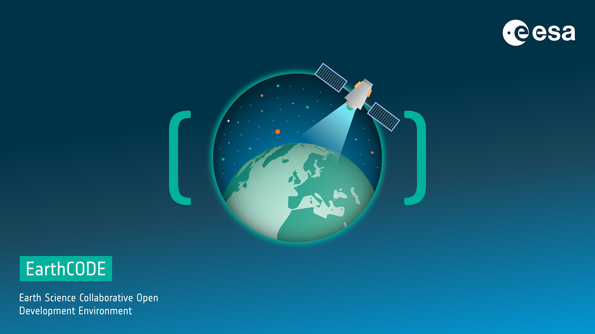

# EarthCODE

*Image source: https://earthcode.esa.int*

[EarthCODE](https://earthcode.esa.int/) is [ESA](https://www.esa.int/)'s strategic initiative for open Earth Observation science. It supports the discovery, publication, and reuse of research outputs from ESA science activities, with a strong emphasis on FAIR principles: findability, accessibility, interoperability, and reusability.

The platform brings together open research data, open-source scientific code, reproducible workflows, documentation, and community resources. Its goal is to help Earth Observation researchers share results in ways that are transparent, reusable, and ready to support further scientific work.

## Role of EarthCODE

**cube.ng** will be fully integrated with EarthCODE as part of its open-science strategy. The project will use EarthCODE (in addition to GitHub) to share its public research outputs, including:

- open-source code repositories for the developed gap-filling and forecasting methods,
- reproducible workflows and analysis scripts,
- updated [Earth System Data Cubes (ESDCs)](https://doi.org/10.5194/esd-11-201-2020),
- gap-filled ESDCs produced by the project,
- machine-readable and human-readable metadata aligned with FAIR principles.

All code and datasets released through **cube.ng** will be published under open licenses. This ensures that the methods, data products, and documentation can be inspected, reused, and extended by the wider Earth system science community.
